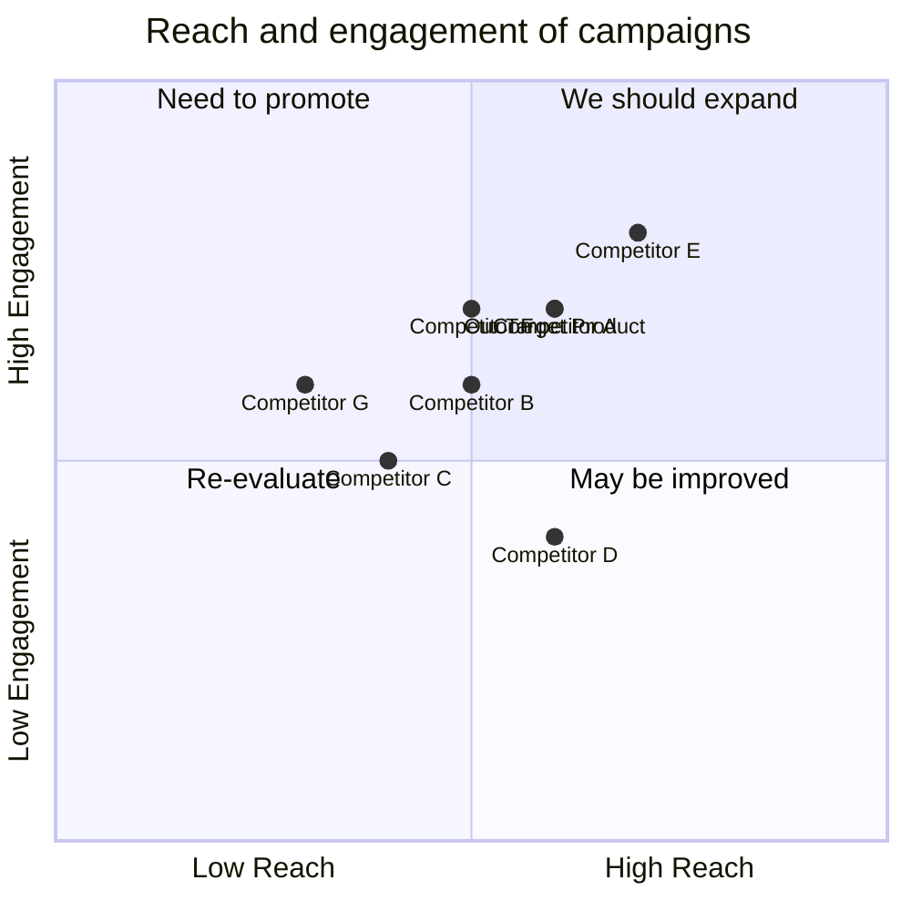

## User Stories:
```python
[
    "As a user, I want to easily navigate through the website to find information about the tech consultancy services",
    "As a user, I want to be able to contact the tech consultancy team easily",
    "As a user, I want to see testimonials and success stories of the tech consultancy services",
    "As a user, I want to be able to request a consultation appointment through the website",
    "As a user, I want to see the expertise and experience of the tech consultancy team"
]
```

## Competitive Analysis:
```python
[
    "Competitor A: Offers similar tech consultancy services in India",
    "Competitor B: Has a user-friendly website with a modern design",
    "Competitor C: Provides a wide range of tech consultancy services",
    "Competitor D: Offers competitive pricing for their services",
    "Competitor E: Has a strong online presence and positive customer reviews",
    "Competitor F: Specializes in specific industries and provides tailored solutions",
    "Competitor G: Offers free resources and educational content"
]
```

## Competitive Quadrant Chart:


## Requirement Analysis:
The product should be a beautiful and elegant Django website that provides tech consultancy services. It should have easy navigation, contact information, testimonials, success stories, consultation appointment request feature, and information about the expertise and experience of the tech consultancy team.

## Requirement Pool:
```python
[
    ("Easy navigation through the website", "P0"),
    ("Contact information easily accessible", "P0"),
    ("Testimonials and success stories section", "P1"),
    ("Consultation appointment request feature", "P1"),
    ("Information about the expertise and experience of the team", "P2")
]
```

## UI Design draft:
The website should have a clean and modern design. It should have a navigation bar at the top with links to different sections of the website. The contact information should be prominently displayed on the homepage. The testimonials and success stories section should showcase positive feedback from previous clients. The consultation appointment request feature should have a form where users can input their details and submit a request. The expertise and experience of the team should be presented in a visually appealing way, such as through a timeline or infographic.

## Anything UNCLEAR:
There are no unclear points.