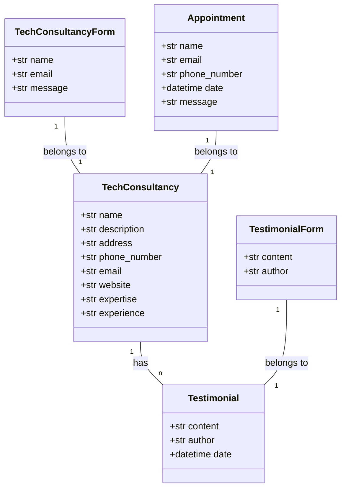
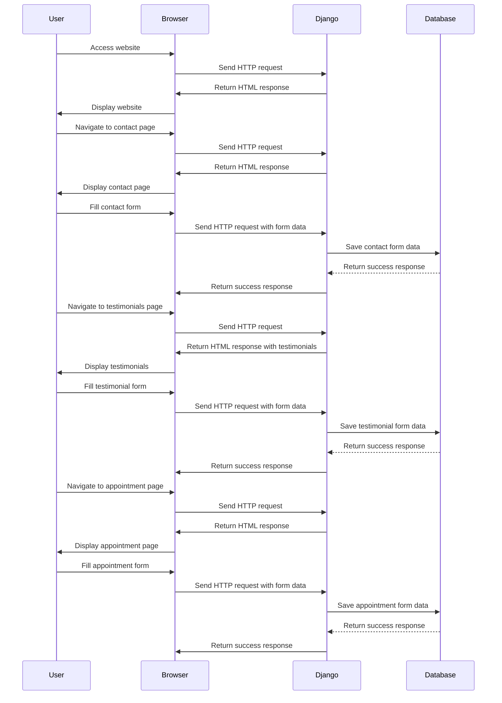

## Implementation approach:

1. Use Django framework for building the website: Django is a high-level Python web framework that provides a clean and efficient way to build web applications. It follows the Model-View-Controller (MVC) architectural pattern and provides built-in features for handling user authentication, database management, and URL routing.

2. Utilize Bootstrap for responsive design: Bootstrap is an open-source CSS framework that provides a set of pre-designed components and styles for creating responsive web pages. It will help us achieve a modern and visually appealing design for the website.

3. Implement a user-friendly navigation system: We will create a navigation bar at the top of the website using Bootstrap's navbar component. This navigation bar will contain links to different sections of the website, making it easy for users to navigate through the pages.

4. Display contact information prominently: We will ensure that the contact information of the tech consultancy team is easily accessible to users. This can be done by displaying the contact details on the homepage or creating a dedicated "Contact Us" page.

5. Showcase testimonials and success stories: To build trust and credibility, we will create a section on the website to showcase testimonials and success stories of the tech consultancy services. This can be implemented using Django's models and templates to dynamically display the feedback from previous clients.

6. Implement a consultation appointment request feature: We will create a form where users can input their details and submit a request for a consultation appointment. This can be achieved using Django's forms and views to handle form submission and validation.

7. Highlight the expertise and experience of the team: We will present the expertise and experience of the tech consultancy team in a visually appealing way. This can be done by creating a timeline or infographic using HTML, CSS, and JavaScript libraries like D3.js or Chart.js.

## Python package name:
```python
"tech_consultancy_website"
```

## File list:
```python
[
    "main.py",
    "models.py",
    "views.py",
    "forms.py",
    "urls.py",
    "templates/index.html",
    "templates/contact.html",
    "templates/testimonials.html",
    "templates/appointment.html",
    "static/css/style.css",
    "static/js/script.js"
]
```

## Data structures and interface definitions:


## Program call flow:


## Anything UNCLEAR:
The requirements are clear to me.